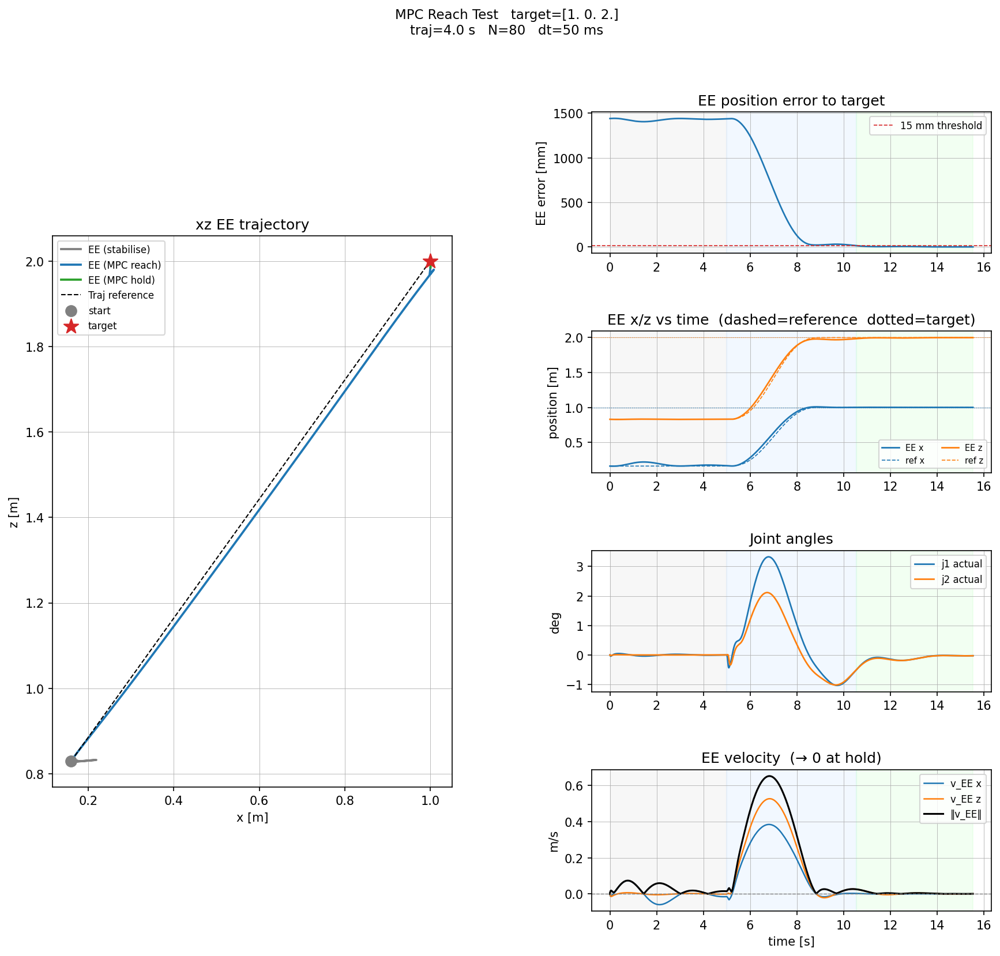
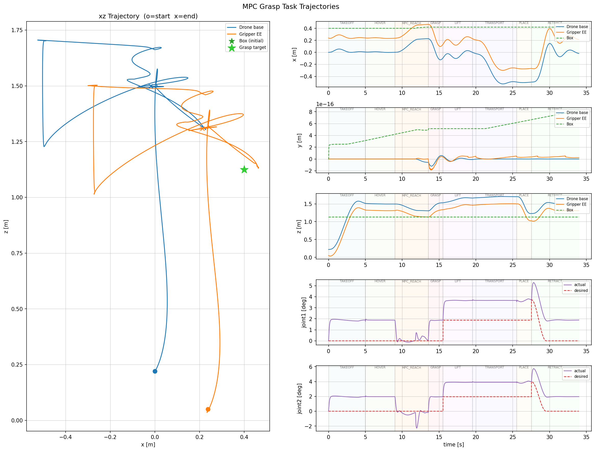
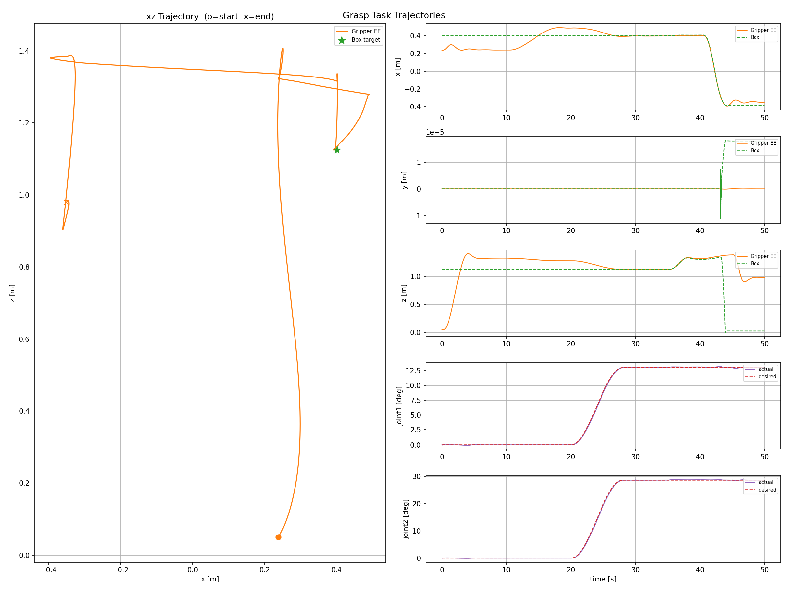
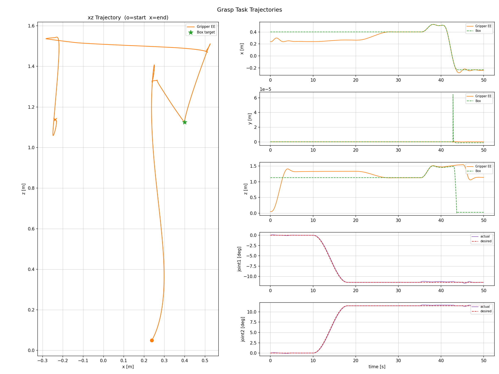

# Aerial Manipulator Dynamics

A research codebase for modelling, simulation, and nonlinear MPC control of a
quadrotor aerial manipulator (AM): a quadrotor platform carrying a 2-DOF planar
robot arm with a parallel-jaw gripper.

The dynamics are expressed analytically via a Newton-Euler recursive algorithm
(`ams/`) and also in CasADi symbolic form for use inside an acados NMPC
(`demo/`).  MuJoCo (`basic/model/am_robot.xml`) serves as the ground-truth
simulator and physics validator throughout.

---

## Contents

- [Repository layout](#repository-layout)
- [Requirements](#requirements)
- [Getting started](#getting-started)
- [Useful scripts and usage](#useful-scripts-and-usage)
  - [MPC demo](#mpc-demo)
  - [PID demo](#pid-demo)
  - [Validation](#validation)
- [Model reference](#model-reference)
  - [XML geometry](#xml-geometry)
  - [Zero configuration](#zero-configuration)
  - [DH parameters](#dh-parameters-option-4-craig-convention)
  - [Gravity compensation](#gravity-compensation-at-zero-config)
- [State and input layout](#state-and-input-layout)

---

## Repository layout

```
ams/                        Core analytical model (pure Python + CasADi)
├── model.py                Physical parameters, DH table, mount_rotation
├── kinematics.py           FK / velocity / acceleration recursion
├── dynamics.py             Newton-Euler forward/backward pass
├── casadi_dynamics.py      CasADi symbolic dynamics (used by acados MPC)
├── simulator.py            ẋ = f(x, u) + RK4 integrator
├── state.py                State vector helper (pack/unpack)
├── math_utils.py           Quaternion utilities, skew-symmetric, etc.
└── inertia_check.py        Validation: model.py vs MuJoCo XML mass/inertia

basic/                      MuJoCo models, shared helpers, and PID controller
├── model/
│   ├── am_robot.xml        Full aerial manipulator MuJoCo model (ground truth)
│   └── quad_only.xml       Quadrotor body only (no arm)
├── test_model.py           Load and inspect the MuJoCo model
└── pid_controller.py       PID controller implementation

demo/                       Nonlinear MPC (acados)
├── mpc_controller.py       Acados OCP setup + SQP solver (MPCController class)
├── mpc_trajectory.py       Minimum-jerk EE trajectory generator
├── mpc_reach_test.py       Main MPC reach test: hover → reach → hold
├── mpc_grasp_task.py       Full pick-and-place with NMPC
├── grasp_task.py           Pick-and-place with decoupled PID + arm-PD
└── grasp_scene.xml         MuJoCo scene with target object

docs/                       Model derivations, code guides, and controller design notes
README.md                   This file
```

Documentation:

- [Dynamics derivation](docs/dynamics.md) and [code organization](docs/code_guide.md)
- [MuJoCo tutorial](docs/mjc_tutorial.md), [MPC integration notes](docs/mpc_mjc.md), and [CasADi port guide](docs/casadi_code_guide.md)
- [PID grasp design](docs/grasp.md) and [NMPC grasp plan](docs/mpc_grasp_plan.md)
- [ADRC position control](docs/adrc_pos_base.md) and [backstepping attitude control](docs/bs_att_base.md)


---


## Requirements

Dependencies depend on which part of the repository you run:

| Workflow | Requirements |
|----------|--------------|
| Analytical model (`ams/`, excluding symbolic dynamics and MuJoCo checks) | Python 3 and NumPy |
| MuJoCo validation, PID demos, and plots | NumPy, `mujoco`, Matplotlib |
| Symbolic dynamics (`ams/casadi_dynamics.py`) | NumPy and CasADi |
| NMPC demos | All of the above, compiled acados libraries, and `acados_template` |
| MPC reach video recording (`--record`) | Additionally `imageio[ffmpeg]` and a working rendering backend |

The repository does not currently pin Python/package versions or an acados
revision, so there is no verified compatibility matrix. Use an isolated Python
environment; the Conda names in older script comments (`main`, `mjc`, `gz`) are
local environment names, not required environments.

Interactive demos need a desktop display and working OpenGL. The MuJoCo Python
package includes the MuJoCo library. On macOS, run passive-viewer scripts with
`mjpython` in place of `python`; see the [MuJoCo Python documentation](https://mujoco.readthedocs.io/en/stable/python.html).

## Getting started

### 1. Install the base environment

From the repository root (`AM_dynamics/`), using a POSIX shell:

```bash
python3 -m venv .venv
source .venv/bin/activate
python -m pip install --upgrade pip
python -m pip install numpy mujoco matplotlib
```

An existing Conda environment works too; activate it and run the same package
installation command. No editable project installation is currently needed
(or configured). Keep running the commands below from the repository root.

### 2. Check the model, then run a PID demo

These checks do not open a viewer:

```bash
python basic/test_model.py
python ams/inertia_check.py
```

The first command prints model information and basic simulation diagnostics.
The second compares analytical mass/inertia and end-effector kinematics against
the XML. Inspect its `OK` / `MISMATCH` output; it reports discrepancies rather
than enforcing a failing process exit status.

On a machine with a display, run the PID grasp task:

```bash
python demo/grasp_task.py
```

For a PID-only comparison without a viewer or interactive plot windows:

```bash
MPLBACKEND=Agg python demo/compare_methods.py
```

Comparison figures are written to `demo/` by default. Many experiments overwrite
fixed output filenames, so preserve previous results before rerunning them.

### 3. Add symbolic dynamics and NMPC (optional)

Install CasADi in the same environment:

```bash
python -m pip install casadi
```

For NMPC, build acados separately from this repository. The Linux example below
requires Git, CMake, Make, and a C/C++ compiler. Follow the official
[acados installation guide](https://docs.acados.org/installation/index.html)
and [Python interface setup](https://docs.acados.org/python_interface/index.html)
for platform-specific details.

```bash
# Choose a persistent location outside AM_dynamics for the acados checkout.
export ACADOS_SOURCE_DIR="$HOME/acados"
git clone --recursive https://github.com/acados/acados.git "$ACADOS_SOURCE_DIR"
cmake -S "$ACADOS_SOURCE_DIR" -B "$ACADOS_SOURCE_DIR/build" -DBUILD_SHARED_LIBS=ON
cmake --build "$ACADOS_SOURCE_DIR/build" --target install -j4
python -m pip install -e "$ACADOS_SOURCE_DIR/interfaces/acados_template"
export LD_LIBRARY_PATH="$ACADOS_SOURCE_DIR/lib${LD_LIBRARY_PATH:+:$LD_LIBRARY_PATH}"
```

If acados is already installed, point `ACADOS_SOURCE_DIR` at that checkout and
install its Python interface into the active environment. Reapply the environment
variables in new shells. The first solver generation may prompt to download the
Tera renderer; follow the linked Python-interface instructions if it is missing.

Back at the repository root, check imports and run the reach experiment:

```bash
python -c "import casadi; from acados_template import AcadosOcpSolver"
MPLBACKEND=Agg python demo/mpc_reach_test.py --rebuild --no-viewer
```

The first run generates and compiles a solver in
`demo/acados_generated_am_mpc/`. Use `--rebuild` after changing the dynamics,
horizon, or OCP configuration. Omit `--no-viewer` and `MPLBACKEND=Agg` for an
interactive run. Import success alone does not verify solver compilation.

Optional video support:

```bash
python -m pip install "imageio[ffmpeg]"
python demo/mpc_reach_test.py --record
```

Recording still requires rendering support, even with `--no-viewer`.

---

## Useful scripts and usage

All commands are run from the **workspace root** (`AM_dynamics/`).


### MPC demo

> Requires the optional NMPC setup above, including `ACADOS_SOURCE_DIR`.


#### `demo/mpc_reach_test.py`
Full MPC reach test: drone hovers at `HOVER_START`, MPC drives the EE along a
minimum-jerk trajectory to `EE_TARGET`, then holds at the target.

```bash
python demo/mpc_reach_test.py --rebuild          # recompile acados
python demo/mpc_reach_test.py --no-tc            # disable hard terminal constraint
```



#### `demo/mpc_grasp_task.py`
Full pick-and-place using the NMPC controller. PID handles take-off; NMPC
takes over for EE reaching, hold at grasp point, and arm retraction.

```bash
python demo/mpc_grasp_task.py
```




### PID demo

#### `demo/grasp_task.py`
Full pick-and-place demo using a **decoupled** PID (platform) + PD (arm)
controller. Eight phases: take-off → arm ready → approach → grasp → lift →
transport → place → retract.

```bash
python demo/grasp_task.py
```

**Move arm only:**



**Move platform only:**



---

### Validation

#### `ams/inertia_check.py`
Compares mass, inertia, and EE forward kinematics between `ams/model.py` and
the MuJoCo XML.  Run this whenever model parameters change.

Expected output: all checks print `OK`; FK EE position error < 1 mm.

#### `basic/test_model.py`
Loads `am_robot.xml`, prints joint names/indices, body tree, and geom extents.
Useful for verifying the MuJoCo model structure.

---

## Model reference

All geometry is derived from `basic/model/am_robot.xml`.

### XML geometry

**Body tree** (positions in parent body frame):

```
base  (free joint)
└── link1   pos="0 0 -0.05"   joint1: hinge axis="0 1 0"
    └── link2   pos="0 0 -0.12"  joint2: hinge axis="0 1 0"
        └── ee      pos="0.16 0 0"  (rigid)
            ├── finger_left   pos="0.02  0.026 0"  (slide joint, y)
            └── finger_right  pos="0.02 -0.026 0"  (slide joint, y)
```

| Body                        | Mass (kg) | Inertia diag [Ixx, Iyy, Izz] (kg·m²) |
|-----------------------------|-----------|---------------------------------------|
| base (quadrotor platform)   | 1.500     | [0.00800, 0.00800, 0.01500]           |
| link1                       | 0.150     | [0.00020, 0.00020, 0.00005]           |
| link2 + ee + fingers (lump) | 0.220     | [0.000254, 0.000821, 0.000908] †      |

† Computed via MuJoCo parallel-axis theorem in `ams/inertia_check.py`.

---

### Zero configuration

At `joint1 = joint2 = 0`, level platform at height `h`:

```
       platform  (0, 0, h)
           │  0.05 m
         joint1  (0, 0, h−0.05)
           │  0.12 m  (link1, −z)
         joint2 ──────────────── EE site  (0.238, 0, h−0.17)
               0.16 m (link2, +x)  +  0.078 m (gripper site)
```

**Shape: L — link1 hangs straight down, link2 extends horizontally forward.**

Sign convention (right-hand rule about local y = `[0,1,0]`):

| Joint | Positive direction | Effect |
|-------|--------------------|--------|
| +θ₁   | about +y           | link1 swings **backward** (−x world) |
| +θ₂   | about +y           | link2 dips **downward** (−z world) |

These match raw MuJoCo `qpos` directly — no remapping needed.

---

### DH parameters (Option 4, Craig convention)

| Transform  | α | a (m) | d (m) | θ             |
|------------|---|-------|-------|---------------|
| {0} → {1} | 0 | 0     | 0     | θ₁            |
| {1} → {2} | 0 | 0.12  | 0     | θ₂ − π/2      |
| {2} → {3} | 0 | 0.16  | 0     | 0 (EE, fixed) |

The `−π/2` offset on θ₂ encodes the L-shape zero configuration so that raw
MuJoCo `qpos` can be passed directly to `compute_link_transforms`.

Mount rotation (platform → arm base frame {0}, columns = {0} axes in {A}):

```python
mount_rotation = np.array([
    [ 0.0, -1.0,  0.0],   # x₀ = [0,0,−1]_A  (down)
    [ 0.0,  0.0,  1.0],   # y₀ = [−1,0,0]_A  (backward)
    [-1.0,  0.0,  0.0],   # z₀ = [0,+1,0]_A  (left = joint axis)
])
```

See [ams/model.py](ams/model.py) for the implemented transforms and frame conventions.

---

### Gravity compensation at zero config

To hold the L-shape hover statically, four input components must be set to their
non-zero equilibrium values:

| Input       | Value         | Reason |
|-------------|---------------|--------|
| `F_ext[2]`  | `m_total · g ≈ 18.34 N` | Upward thrust |
| `tau_ext[1]`| `−m₂ · g · x_com ≈ −0.274 Nm` | Platform pitch (arm moment) |
| `tau_j[0]`  | `−0.274 Nm`   | Joint 1 hold |
| `tau_j[1]`  | `−0.274 Nm`   | Joint 2 hold |

Computed via inverse dynamics in `ams/dynamics.py`.

---

## State and input layout

**State** `x ∈ ℝ¹⁷`:

| Indices | Symbol     | Description                         |
|---------|-----------|-------------------------------------|
| 0:3     | `p_A`     | Platform position (world frame)      |
| 3:6     | `v_A`     | Platform linear velocity (world)     |
| 6:10    | `q_A`     | Platform quaternion `[x,y,z,w]`      |
| 10:13   | `ω_A`     | Platform angular velocity (body)     |
| 13:15   | `θ`       | Joint angles `[θ₁, θ₂]`             |
| 15:17   | `θ̇`      | Joint velocities                     |

**Input** `u ∈ ℝ⁸`:

| Indices | Symbol      | Description                          |
|---------|------------|--------------------------------------|
| 0:3     | `F_ext`    | External force on platform (world)   |
| 3:6     | `τ_ext`    | External torque on platform (body)   |
| 6:8     | `τ_j`      | Joint torques `[τ_j1, τ_j2]`        |

Note: `F_ext[0] = F_ext[1] = 0` (body-z thrust only); bounds enforced by MPC.

---
